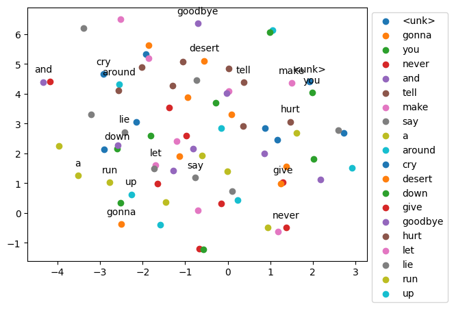

# N-Gram Language Model with Feedforward Neural Networks


[](https://www.python.org/downloads/)
[](https://pytorch.org/)


This repository contains a PyTorch implementation of an N-Gram language model using feedforward neural networks. The model is trained to predict the next word in a sequence based on the preceding N words (context). This project demonstrates fundamental concepts in Natural Language Processing (NLP), including tokenization, embedding layers, and training neural networks for sequence prediction.


## Overview


This project explores the use of Feedforward Neural Networks (FNNs) for language modeling. The primary goal is to build and train a neural network capable of learning word relationships and generating coherent text sequences. The implementation leverages the PyTorch framework and covers essential NLP techniques:


- **Tokenization & Indexing:** Converting raw text into numerical representations that the model can understand.
- **Embedding Layers:** Creating dense vector representations of words to capture semantic meaning.
- **N-gram Generation:** Structuring the training data into context-target pairs for sequence prediction.
- **Multi-Class Neural Network:** Designing and training a feedforward network to predict the probability distribution over the vocabulary for the next word.
- **Training Process:** Utilizing loss functions (Cross-Entropy) and backpropagation with optimization (SGD) to improve the model's predictive capabilities.


## Objectives


- Implement a feedforward neural network with embedding layers in PyTorch for language modeling.
- Fine-tune the output layer to predict the next word in a sequence.
- Apply key NLP techniques such as tokenization and n-gram creation.
- Train the model effectively using appropriate loss functions and optimization algorithms.
- Visualize word embeddings to understand the learned semantic relationships.
- Evaluate model performance using loss and perplexity metrics.
- Demonstrate the model's ability to generate text on both song lyrics and nursery rhymes.


## Repository Structure
```bash
FNN-NGram-Language-Model-PyTorch/
├── 2gram.pth
├── 4gram.pth
├── 8gram.pth
├── data/
│   ├── nursery_rhymes.txt
│   └── song.txt
├── images/
│   ├── context_2_embd_visual.png
│   ├── context_4_embd_visual.png
│   ├── context_8_embd_visual.png
│   ├── models_loss_epoch.png
│   └── models_perplexity.png
└── notebook.ipynb
```

## Code Explanation
The core implementation is within the `notebook.ipynb` file, covering the following key stages:

- **Data Loading and Preprocessing:** Reading text data and preparing it for the model.  
- **Embedding Layer Creation:** Generating dense vector representations for words.  
- **N-gram Generation:** Creating context-target pairs for training.  
- **Data Batching:** Organizing the data into manageable batches for efficient training.  
- **Neural Network Model Definition:** Implementing the feedforward network architecture.  
- **Text Generation Function:** Creating a method to generate new text based on the trained model.  
- **Model Training:** Training the neural network using the prepared data.  
- **Visualization of Embeddings and Training Metrics:** Using tools like t-SNE to visualize word embeddings and plotting loss and perplexity over epochs.  

---

## Visualizations

### Word Embedding Visualizations
The following images illustrate the 2D embeddings of words learned by the models with context sizes of 2, 4, and 8, visualized using t-SNE. Similar words tend to cluster together, indicating that the model has captured some semantic relationships.

  
  
  

---

### Loss Over Epochs
This plot illustrates the cross-entropy loss of the 2-gram, 4-gram, and 8-gram models over the training epochs. A decreasing trend generally indicates that the models are learning effectively.

  

---

### Perplexity Over Epochs
This plot shows the perplexity of the different N-gram models during training. Perplexity is a measure of how well a language model predicts a sequence of words. Lower perplexity scores indicate better performance.

  

---

## Usage
Ensure that all the required libraries are installed in your Python environment.  

Run the `notebook.ipynb` file in a Jupyter Notebook or JupyterLab environment. The notebook contains the complete workflow for data processing, model training, and visualization.  

The pre-trained model state dictionaries (`2gram.pth`, `4gram.pth`, `8gram.pth`) are provided in the repository. You can load these to use the pre-trained models without needing to retrain them.

---

## Further Work
- **Hyperparameter Tuning:** Experiment with different hyperparameters such as the embedding dimension, the size of the hidden layers, the learning rate of the optimizer, and the number of training epochs to potentially improve model performance.  
- **Exploring Different Optimizers:** Try other optimization algorithms like Adam or RMSprop, which might lead to faster convergence and better results.  
- **Training on Larger Datasets:** Training the models on larger and more diverse text corpora could significantly enhance their ability to generalize and generate more coherent and varied text.  
- **Implementing More Advanced Language Models:** For a more sophisticated approach to language modeling, consider implementing and comparing the performance of Recurrent Neural Networks (RNNs), Long Short-Term Memory networks (LSTMs), or Transformer networks.  


